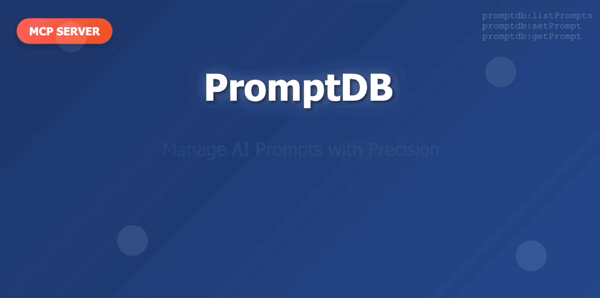

# PromptDB MCP Server


<p align="center">
  
</p>

A Model Context Protocol (MCP) server that provides prompt storage and retrieval functionality. Store, version, and manage your prompts with rich metadata and caching for optimal performance.

## Features

- **Prompt Storage**: Store prompts as individual JSON files with rich metadata
- **Version Management**: Automatic versioning with history preservation
- **Caching**: In-memory LRU cache for performance optimization
- **Rich Metadata**: Tags, descriptions, timestamps, and version tracking
- **MCP Integration**: Full compatibility with MCP-enabled applications

## Installation

### Global Installation
```bash
# Using pnpm (recommended)
pnpm add -g promptdb-mcp-server

# Using npm
npm install -g promptdb-mcp-server
```

### Local Development
```bash
# Clone and install dependencies
git clone <repository-url>
cd promptdb-mcp-server
pnpm install

# Build the project
pnpm build

# Start the server
pnpm start
```

## MCP Configuration

Add to your MCP client configuration:

```json
{
  "mcpServers": {
    "promptdb": {
      "command": "promptdb-mcp-server",
      "args": []
    }
  }
}
```

## Tools

### listPrompts
List all available prompts with their content and versions.

**Parameters**: None

**Returns**: Array of prompts with taskname, content, and version

### getPrompt
Retrieve a specific prompt by task name.

**Parameters**:
- `taskname` (required): The task name identifier
- `version` (optional): Specific version (defaults to latest)

**Returns**: Full prompt metadata including content, timestamps, tags, and description

### setPrompt
Create or update a prompt for a task.

**Parameters**:
- `taskname` (required): The task name identifier
- `content` (required): The prompt content
- `description` (optional): Human-readable description
- `tags` (optional): Array of searchable tags

**Returns**: Confirmation with version information

## Data Model

### Prompt Structure
```typescript
interface PromptMetadata {
  content: string;      // The prompt content
  created: string;      // ISO timestamp of creation
  updated: string;      // ISO timestamp of last update
  version: string;      // Semantic version (1.0, 1.1, etc.)
  tags: string[];       // Searchable tags
  description: string;  // Human-readable description
}
```

### File Organization
- Latest version: `prompts/{taskname}.json`
- Historical versions: `prompts/{taskname}_v{version}.json`
- Automatic archiving of previous versions

### Version Management
- New prompts start at version `1.0`
- Content updates increment minor version (`1.0` → `1.1` → `1.2`)
- Previous versions are automatically archived
- Latest version is always accessible without specifying version

## Usage Examples

### Storing a Prompt
```json
{
  "tool": "setPrompt",
  "arguments": {
    "taskname": "code-review",
    "content": "Review this code for best practices, security issues, and performance optimizations...",
    "description": "Comprehensive code review prompt",
    "tags": ["code", "review", "security", "performance"]
  }
}
```

### Retrieving a Prompt
```json
{
  "tool": "getPrompt",
  "arguments": {
    "taskname": "code-review"
  }
}
```

### Listing All Prompts
```json
{
  "tool": "listPrompts",
  "arguments": {}
}
```

## Development

### Project Structure
```
promptdb-mcp-server/
├── src/
│   ├── index.ts              # Main entry point
│   ├── server.ts             # MCP server setup
│   ├── tools/                # Tool implementations
│   ├── storage/              # File system operations
│   ├── cache/                # In-memory caching
│   └── utils/                # Validation helpers
├── prompts/                  # Prompt storage directory
├── package.json
├── tsconfig.json
└── vite.config.ts
```

### Development Commands
```bash
# Install dependencies
pnpm install

# Build project
pnpm build

# Development with watch mode
pnpm dev

# Start server
pnpm start

# Clean build artifacts
pnpm clean
```

### Testing
Use the MCP Inspector or any MCP-compatible client to test the server:

1. Start the server: `pnpm start`
2. Connect via MCP Inspector
3. Test the available tools

## Performance

### Caching Strategy
- **Cache Hit**: Immediate return from memory
- **Cache Miss**: Load from file system, cache result
- **Cache Invalidation**: Automatic on prompt updates
- **Memory Management**: LRU eviction at 100 items

### File System Optimization
- Asynchronous file operations throughout
- On-demand directory creation
- Robust error handling
- Concurrent access safety

## Error Handling

The server handles various error conditions gracefully:
- File system permission errors
- Invalid JSON parsing
- Concurrent access conflicts
- Cache consistency issues
- Input validation errors

## Troubleshooting

### Common Issues

1. **Server not starting**: Check Node.js version (18+) and dependencies
2. **Tool not found**: Verify server is properly connected to MCP client
3. **Directory creation errors**:
   - Error: `ENOENT: no such file or directory, mkdir '/prompts'`
   - **Solution**: The server creates a `prompts` directory in the current working directory. Ensure the MCP client has write permissions to the directory where it's running.
   - **Alternative**: The server will automatically create the directory with proper permissions
4. **File permissions**: Ensure write access to prompts directory
5. **JSON parsing errors**: Validate prompt file format

### Directory Configuration
The server creates prompts in the current working directory by default:
- When run locally: `./prompts/` in the project directory
- When installed globally: `./prompts/` in the directory where the MCP client runs
- The server automatically creates the directory if it doesn't exist

### Validation Errors
- Task names must be alphanumeric with hyphens/underscores only
- Content cannot be empty
- Version format must be X.Y (e.g., 1.0, 2.1)

## License

MIT License - see LICENSE file for details

## Contributing

1. Fork the repository
2. Create a feature branch
3. Make your changes
4. Add tests if applicable
5. Submit a pull request

## Support

For issues and questions:
- Create an issue on GitHub
- Check the documentation
- Review the implementation plan