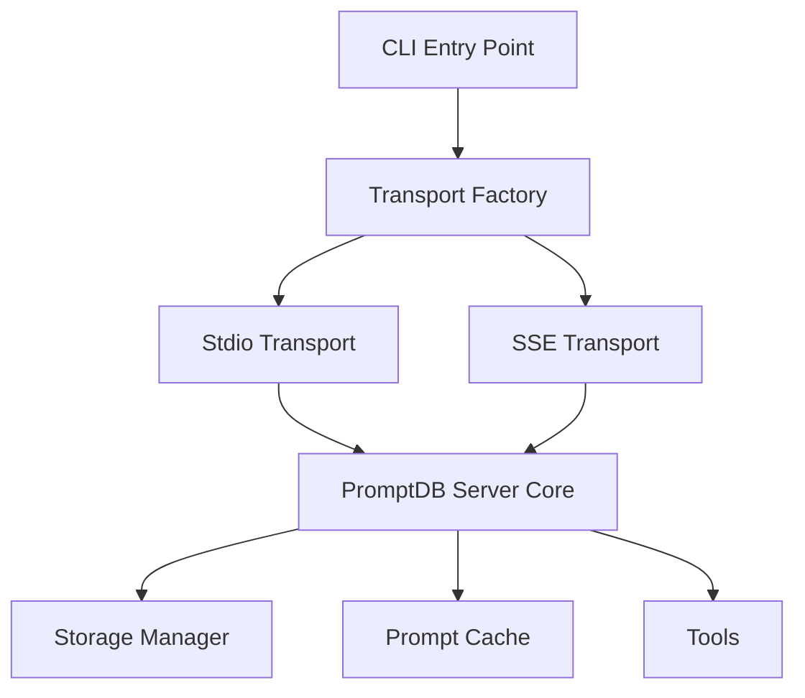

# PromptDB MCP Server SSE Transport Refactor Plan

## Overview

This document outlines the comprehensive refactor plan to add Server-Sent Events (SSE) transport support to the PromptDB MCP server, enabling deployment to cloud platforms like Vercel, Netlify, and other serverless environments.

## Current Architecture Analysis

### Current State
- **Transport**: Currently uses `StdioServerTransport` only
- **Entry Point**: [`src/index.ts`](src/index.ts:1) - Simple CLI entry point
- **Server Class**: [`src/server.ts`](src/server.ts:15) - Hardcoded to use stdio transport
- **Deployment**: Local/CLI only, not cloud-ready

### Limitations
1. **Single Transport**: Only supports stdio transport
2. **Hardcoded Transport**: Transport is instantiated directly in server class
3. **No CLI Options**: No command-line argument parsing
4. **No Environment Configuration**: No environment-based configuration
5. **No HTTP Server**: No web server capabilities for SSE

## Refactor Goals

1. **Multi-Transport Support**: Support both stdio and SSE transports
2. **Command-Line Selection**: Allow transport selection via CLI arguments
3. **Environment Configuration**: Support environment-based configuration
4. **Cloud Deployment Ready**: Enable deployment to Vercel, Netlify, etc.
5. **Backward Compatibility**: Maintain existing stdio functionality
6. **Production Ready**: Add proper logging, error handling, and monitoring

## Architecture Changes

### 1. Transport Abstraction Layer



### 2. New File Structure

```
src/
├── index.ts                    # Enhanced CLI entry point
├── server.ts                   # Refactored server class
├── transports/                 # New transport layer
│   ├── TransportFactory.ts     # Transport factory
│   ├── StdioTransport.ts       # Stdio transport wrapper
│   ├── SSETransport.ts         # SSE transport implementation
│   └── types.ts                # Transport interfaces
├── config/                     # New configuration layer
│   ├── Config.ts               # Configuration management
│   └── types.ts                # Configuration interfaces
├── http/                       # New HTTP server layer
│   ├── HttpServer.ts           # Express/Fastify server
│   ├── middleware/             # HTTP middleware
│   │   ├── cors.ts             # CORS handling
│   │   ├── auth.ts             # Authentication (future)
│   │   └── logging.ts          # Request logging
│   └── routes/                 # HTTP routes
│       ├── health.ts           # Health check endpoint
│       ├── sse.ts              # SSE endpoint
│       └── api.ts              # REST API endpoints (future)
├── cache/                      # Existing
├── storage/                    # Existing
├── tools/                      # Existing
└── utils/                      # Enhanced utilities
    ├── validation.ts           # Existing
    ├── logger.ts               # New logging utility
    └── cli.ts                  # CLI argument parsing
```

## Implementation Plan

### Phase 1: Core Refactoring (Foundation)

#### 1.1 Create Transport Interfaces
**File**: `src/transports/types.ts`
```typescript
export interface TransportConfig {
  type: 'stdio' | 'sse';
  port?: number;
  host?: string;
  cors?: boolean;
  auth?: boolean;
}

export interface Transport {
  connect(server: Server): Promise<void>;
  disconnect(): Promise<void>;
  isConnected(): boolean;
}
```

#### 1.2 Create Configuration Management
**File**: `src/config/Config.ts`
```typescript
export class Config {
  static fromCLI(args: string[]): TransportConfig;
  static fromEnv(): TransportConfig;
  static getDefault(): TransportConfig;
}
```

#### 1.3 Refactor Server Class
**File**: `src/server.ts` (Modified)
```typescript
export class PromptDBServer {
  constructor(private config: TransportConfig) {
    // Remove hardcoded transport
  }
  
  async run(transport: Transport): Promise<void> {
    // Accept transport as parameter
  }
}
```

#### 1.4 Create Transport Factory
**File**: `src/transports/TransportFactory.ts`
```typescript
export class TransportFactory {
  static create(config: TransportConfig): Transport {
    switch (config.type) {
      case 'stdio': return new StdioTransport(config);
      case 'sse': return new SSETransport(config);
    }
  }
}
```

### Phase 2: SSE Transport Implementation

#### 2.1 HTTP Server Foundation
**File**: `src/http/HttpServer.ts`
```typescript
export class HttpServer {
  private app: Express;
  private server: http.Server;
  
  constructor(private config: TransportConfig) {}
  
  async start(): Promise<void> {
    // Setup Express server with middleware
  }
  
  setupSSEEndpoint(mcpServer: Server): void {
    // Setup /sse endpoint for MCP communication
  }
}
```

#### 2.2 SSE Transport Implementation
**File**: `src/transports/SSETransport.ts`
```typescript
export class SSETransport implements Transport {
  private httpServer: HttpServer;
  
  constructor(private config: TransportConfig) {}
  
  async connect(server: Server): Promise<void> {
    // Setup HTTP server with SSE endpoint
  }
}
```

#### 2.3 SSE Endpoint Handler
**File**: `src/http/routes/sse.ts`
```typescript
export function setupSSERoute(app: Express, mcpServer: Server) {
  app.get('/sse', (req, res) => {
    // Setup SSE headers
    // Handle MCP protocol over SSE
  });
}
```

### Phase 3: CLI Enhancement

#### 3.1 CLI Argument Parsing
**File**: `src/utils/cli.ts`
```typescript
export interface CLIOptions {
  transport: 'stdio' | 'sse';
  port?: number;
  host?: string;
  help?: boolean;
  version?: boolean;
}

export function parseArgs(args: string[]): CLIOptions;
export function showHelp(): void;
```

#### 3.2 Enhanced Entry Point
**File**: `src/index.ts` (Refactored)
```typescript
#!/usr/bin/env node

import { parseArgs, showHelp } from './utils/cli.js';
import { Config } from './config/Config.js';
import { TransportFactory } from './transports/TransportFactory.js';
import { PromptDBServer } from './server.js';

async function main() {
  const cliOptions = parseArgs(process.argv.slice(2));
  
  if (cliOptions.help) {
    showHelp();
    return;
  }
  
  const config = Config.fromCLI(process.argv.slice(2));
  const transport = TransportFactory.create(config);
  const server = new PromptDBServer(config);
  
  await server.run(transport);
}
```

### Phase 4: Cloud Deployment Support

#### 4.1 Vercel Configuration
**File**: `vercel.json`
```json
{
  "version": 2,
  "builds": [
    {
      "src": "dist/index.js",
      "use": "@vercel/node"
    }
  ],
  "routes": [
    {
      "src": "/sse",
      "dest": "/dist/index.js"
    },
    {
      "src": "/health",
      "dest": "/dist/index.js"
    }
  ],
  "env": {
    "TRANSPORT_TYPE": "sse",
    "PORT": "3000"
  }
}
```

#### 4.2 Environment Configuration
**File**: `.env.example`
```env
# Transport Configuration
TRANSPORT_TYPE=sse
PORT=3000
HOST=0.0.0.0

# CORS Configuration
CORS_ENABLED=true
CORS_ORIGIN=*

# Storage Configuration
PROMPTS_DIR=./prompts

# Logging
LOG_LEVEL=info
```

#### 4.3 Package.json Updates
```json
{
  "scripts": {
    "start": "node dist/index.js",
    "start:stdio": "node dist/index.js --transport stdio",
    "start:sse": "node dist/index.js --transport sse --port 3000",
    "dev:sse": "npm run build && npm run start:sse",
    "vercel-build": "npm run build"
  },
  "dependencies": {
    "express": "^4.18.0",
    "cors": "^2.8.5",
    "helmet": "^7.0.0",
    "commander": "^11.0.0"
  }
}
```

## Detailed Implementation

### Transport Factory Implementation

```typescript
// src/transports/TransportFactory.ts
import { TransportConfig, Transport } from './types.js';
import { StdioTransport } from './StdioTransport.js';
import { SSETransport } from './SSETransport.js';

export class TransportFactory {
  static create(config: TransportConfig): Transport {
    switch (config.type) {
      case 'stdio':
        return new StdioTransport(config);
      case 'sse':
        return new SSETransport(config);
      default:
        throw new Error(`Unsupported transport type: ${config.type}`);
    }
  }
}
```

### SSE Transport Implementation

```typescript
// src/transports/SSETransport.ts
import { Server } from '@modelcontextprotocol/sdk/server/index.js';
import { Transport, TransportConfig } from './types.js';
import { HttpServer } from '../http/HttpServer.js';

export class SSETransport implements Transport {
  private httpServer: HttpServer;
  private connected = false;

  constructor(private config: TransportConfig) {
    this.httpServer = new HttpServer(config);
  }

  async connect(server: Server): Promise<void> {
    await this.httpServer.start();
    this.httpServer.setupSSEEndpoint(server);
    this.connected = true;
    
    console.error(`PromptDB MCP Server running on http://${this.config.host}:${this.config.port}/sse`);
  }

  async disconnect(): Promise<void> {
    await this.httpServer.stop();
    this.connected = false;
  }

  isConnected(): boolean {
    return this.connected;
  }
}
```

### HTTP Server with SSE Support

```typescript
// src/http/HttpServer.ts
import express, { Express } from 'express';
import cors from 'cors';
import helmet from 'helmet';
import { Server } from '@modelcontextprotocol/sdk/server/index.js';
import { TransportConfig } from '../transports/types.js';

export class HttpServer {
  private app: Express;
  private server: any;

  constructor(private config: TransportConfig) {
    this.app = express();
    this.setupMiddleware();
  }

  private setupMiddleware(): void {
    this.app.use(helmet());
    
    if (this.config.cors) {
      this.app.use(cors({
        origin: process.env.CORS_ORIGIN || '*',
        credentials: true
      }));
    }

    this.app.use(express.json());
  }

  async start(): Promise<void> {
    return new Promise((resolve) => {
      this.server = this.app.listen(this.config.port, this.config.host, () => {
        resolve();
      });
    });
  }

  async stop(): Promise<void> {
    if (this.server) {
      this.server.close();
    }
  }

  setupSSEEndpoint(mcpServer: Server): void {
    this.app.get('/sse', (req, res) => {
      // Set SSE headers
      res.writeHead(200, {
        'Content-Type': 'text/event-stream',
        'Cache-Control': 'no-cache',
        'Connection': 'keep-alive',
        'Access-Control-Allow-Origin': '*',
        'Access-Control-Allow-Headers': 'Cache-Control'
      });

      // Create SSE transport for this connection
      const sseTransport = new SSEServerTransport(req, res);
      
      // Connect MCP server to this SSE transport
      mcpServer.connect(sseTransport).catch(error => {
        console.error('SSE connection error:', error);
        res.end();
      });

      // Handle client disconnect
      req.on('close', () => {
        sseTransport.close();
      });
    });

    // Health check endpoint
    this.app.get('/health', (req, res) => {
      res.json({ status: 'healthy', timestamp: new Date().toISOString() });
    });
  }
}
```

### CLI Configuration

```typescript
// src/utils/cli.ts
import { Command } from 'commander';
import { TransportConfig } from '../transports/types.js';

export interface CLIOptions {
  transport: 'stdio' | 'sse';
  port?: number;
  host?: string;
  cors?: boolean;
}

export function parseArgs(args: string[]): CLIOptions {
  const program = new Command();
  
  program
    .name('promptdb-mcp-server')
    .description('PromptDB MCP Server with multiple transport support')
    .version('1.0.0')
    .option('-t, --transport <type>', 'Transport type (stdio|sse)', 'stdio')
    .option('-p, --port <number>', 'Port for SSE transport', '3000')
    .option('-h, --host <string>', 'Host for SSE transport', '0.0.0.0')
    .option('--cors', 'Enable CORS for SSE transport', false);

  program.parse(args, { from: 'user' });
  const options = program.opts();

  return {
    transport: options.transport,
    port: parseInt(options.port),
    host: options.host,
    cors: options.cors
  };
}

export function showHelp(): void {
  console.log(`
PromptDB MCP Server

Usage:
  promptdb-mcp-server [options]

Options:
  -t, --transport <type>  Transport type: stdio (default) or sse
  -p, --port <number>     Port for SSE transport (default: 3000)
  -h, --host <string>     Host for SSE transport (default: 0.0.0.0)
  --cors                  Enable CORS for SSE transport
  --help                  Show this help message
  --version               Show version number

Examples:
  promptdb-mcp-server                           # Use stdio transport (default)
  promptdb-mcp-server --transport sse           # Use SSE transport on port 3000
  promptdb-mcp-server -t sse -p 8080 --cors     # SSE on port 8080 with CORS
  
Environment Variables:
  TRANSPORT_TYPE          Transport type (stdio|sse)
  PORT                    Port for SSE transport
  HOST                    Host for SSE transport
  CORS_ENABLED            Enable CORS (true|false)
  PROMPTS_DIR             Directory for prompt storage
`);
}
```

## Migration Strategy

### Phase 1: Backward Compatibility (Week 1)
1. Create new transport layer without breaking existing functionality
2. Maintain current CLI behavior as default
3. Add new CLI options but keep stdio as default

### Phase 2: SSE Implementation (Week 2)
1. Implement HTTP server and SSE transport
2. Add comprehensive testing for SSE functionality
3. Create deployment configurations

### Phase 3: Documentation & Examples (Week 3)
1. Update README with new transport options
2. Create deployment guides for various platforms
3. Add usage examples for both transports

### Phase 4: Testing & Optimization (Week 4)
1. Comprehensive testing across different environments
2. Performance optimization for cloud deployments
3. Security hardening and best practices

## Testing Strategy

### Unit Tests
- Transport factory functionality
- Configuration parsing
- HTTP server setup
- SSE connection handling

### Integration Tests
- End-to-end MCP communication over SSE
- Multi-client SSE connections
- Transport switching functionality

### Deployment Tests
- Vercel deployment verification
- Netlify deployment verification
- Local development server testing

## Security Considerations

### SSE Transport Security
1. **CORS Configuration**: Proper CORS setup for cross-origin requests
2. **Rate Limiting**: Implement rate limiting for SSE connections
3. **Authentication**: Future support for API key authentication
4. **Input Validation**: Validate all HTTP inputs
5. **Error Handling**: Secure error messages without information leakage

### Environment Security
1. **Environment Variables**: Secure handling of sensitive configuration
2. **HTTPS**: Support for HTTPS in production deployments
3. **Headers**: Security headers via Helmet.js

## Performance Considerations

### SSE Optimization
1. **Connection Pooling**: Efficient handling of multiple SSE connections
2. **Memory Management**: Proper cleanup of disconnected clients
3. **Caching**: Leverage existing prompt caching for SSE responses

### Cloud Deployment
1. **Cold Start Optimization**: Minimize serverless cold start times
2. **Resource Usage**: Optimize memory and CPU usage for cloud limits
3. **Scaling**: Design for horizontal scaling in cloud environments

## Monitoring & Observability

### Logging
- Structured logging with different levels
- Request/response logging for debugging
- Error tracking and reporting

### Metrics
- Connection count and duration
- Request latency and throughput
- Error rates and types

### Health Checks
- HTTP health endpoint for load balancers
- Transport-specific health indicators
- Storage system health monitoring

## Deployment Configurations

### Vercel
```json
{
  "version": 2,
  "builds": [{ "src": "dist/index.js", "use": "@vercel/node" }],
  "routes": [
    { "src": "/sse", "dest": "/dist/index.js" },
    { "src": "/health", "dest": "/dist/index.js" }
  ]
}
```

### Netlify
```toml
[build]
  command = "npm run build"
  functions = "dist"

[[redirects]]
  from = "/sse"
  to = "/.netlify/functions/index"
  status = 200

[[redirects]]
  from = "/health"
  to = "/.netlify/functions/index"
  status = 200
```

### Railway
```dockerfile
FROM node:18-alpine
WORKDIR /app
COPY package*.json ./
RUN npm ci --only=production
COPY dist ./dist
EXPOSE 3000
CMD ["node", "dist/index.js", "--transport", "sse", "--port", "3000"]
```

## Success Criteria

1. **Backward Compatibility**: Existing stdio functionality remains unchanged
2. **SSE Functionality**: Full MCP protocol support over SSE
3. **Cloud Deployment**: Successful deployment to at least 2 cloud platforms
4. **Performance**: SSE transport performs within 10% of stdio transport
5. **Documentation**: Complete documentation for all transport options
6. **Testing**: 90%+ test coverage for new functionality

## Risks & Mitigation

### Technical Risks
1. **MCP SDK Compatibility**: Risk of SSE transport incompatibility
   - *Mitigation*: Thorough testing with MCP SDK examples
2. **Cloud Platform Limitations**: Serverless timeout/memory limits
   - *Mitigation*: Optimize for cloud constraints, implement connection pooling
3. **WebSocket Alternative**: SSE might not be optimal for bidirectional communication
   - *Mitigation*: Consider WebSocket transport as future enhancement

### Operational Risks
1. **Breaking Changes**: Risk of breaking existing integrations
   - *Mitigation*: Maintain backward compatibility, comprehensive testing
2. **Security Vulnerabilities**: New HTTP endpoints introduce attack surface
   - *Mitigation*: Security review, input validation, rate limiting

## Future Enhancements

1. **WebSocket Transport**: Add WebSocket support for better bidirectional communication
2. **Authentication**: Add API key and OAuth support
3. **Load Balancing**: Support for multiple server instances
4. **Metrics Dashboard**: Web-based monitoring dashboard
5. **GraphQL API**: Alternative API interface for web clients

## Conclusion

This refactor plan provides a comprehensive approach to adding SSE transport support while maintaining backward compatibility and enabling cloud deployment. The phased approach ensures minimal disruption to existing functionality while adding powerful new capabilities for modern deployment scenarios.